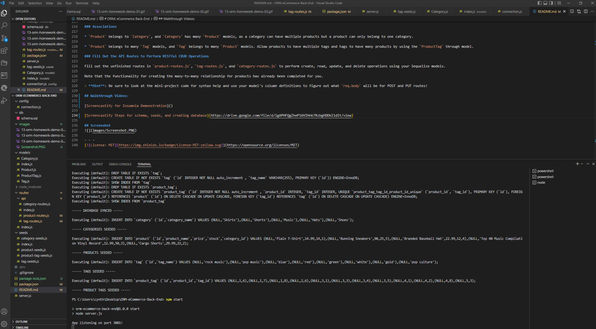

# ORM: eCommerce Back-End

## Description

The back end for an **Object Relational Mapping (ORM)** eCommerce site by modifying starter code using Express.js API to use Sequelize to interact with a MySQL database. Use Insomnia to check all routes.

## Installation
[Initializer](https://docs.npmjs.com/cli/v8/commands/npm-init)
```
npm init
```

[MySQL2 CLI](https://www.npmjs.com/package/mysql2) to connect to the SQL database and 
perform queries.
```
npm install --save mysql2
```

[Sequalize](https://sequelize.org/docs/v6/getting-started/)
```
npm install sequelize
```

[To hide password using .env file](https://www.npmjs.com/package/dotenv)
```
npm install dotenv --save
```

[To Install Insomnia](https://docs.insomnia.rest/insomnia/install) Insomnia is not installed as a CLI but it it a program used for opening API routes. 

## Usage

To activate SQL Terminal.
```
mysql -u root -p
```

Run schema file in SQL server.
```
source schema.sql
```

Exit SQL Terminal.
```
quit
```

Run the following commands in the Node Terminal.
```
npm run seed
```

```
npm start
```

## Items Completed

✅A functional Express.js. API in which a database name, MySQL username, and MySQL password to an environment variable.

✅Can connect to the database using Sequelize and run schema and seed commands.

✅Development database is created and is seeded with test data.

✅Command prompt invokes the application so the server is started and the Sequelize models are synced to the MySQL database

✅Open API `GET` routes in Insomnia for categories, products, or tags so the data for each of these routes is displayed in a formatted JSON

`GET` Categories
```
localhost:3001/api/categories
```
`GET` Products
```
localhost:3001/api/products
```
`GET` tags
```
localhost:3001/api/tags
```

✅Open API `GET` routes to return a single category, a single product, and a single tag being tested in Insomnia

`GET` Category by ID
```
localhost:3001/api/categories/1
```
`GET` Products Get One
```
localhost:3001/api/products/1
```
`GET` tags by ID
```
localhost:3001/api/tags/1
```

✅Test API POST, PUT, and DELETE routes in Insomnia to successfully create, update, and delete data in my database. Repeat the below walkthrough with Products & tags.

`DELETE` Categories: Delete Category by ID
```
localhost:3001/api/categories/6
```

`POST` Categories: Create Category
```
localhost:3001/api/categories
```

`PUT` Categories: Update Category
```
localhost:3001/api/categories/6
```

### Database Models

* `Category`

  * `id`

    * Integer.
  
    * Doesn't allow null values.
  
    * Set as primary key.
  
    * Uses auto increment.

  * `category_name`
  
    * String.
  
    * Doesn't allow null values.

* `Product`

  * `id`
  
    * Integer.
  
    * Doesn't allow null values.
  
    * Set as primary key.
  
    * Uses auto increment.

  * `product_name`
  
    * String.
  
    * Doesn't allow null values.

  * `price`
  
    * Decimal.
  
    * Doesn't allow null values.
  
    * Validates that the value is a decimal.

  * `stock`
  
    * Integer.
  
    *** Does** allow null values for deletion.
  
    * Set a default value of `10`.
  
    * Validates that the value is numeric.

  * `category_id`
  
    * Integer.
  
    * References the `Category` model's `id`.

* `Tag`

  * `id`
  
    * Integer.
  
    * Doesn't allow null values.
  
    * Set as primary key.
  
    * Uses auto increment.

  * `tag_name`
  
    * String.

* `ProductTag`

  * `id`

    * Integer.

    * Doesn't allow null values.

    * Set as primary key.

    * Uses auto increment.

  * `product_id`

    * Integer.

    * References the `Product` model's `id`.

  * `tag_id`

    * Integer.

    * References the `Tag` model's `id`.

### Associations

* `Product` belongs to `Category`, and `Category` has many `Product` models, as a category can have multiple products but a product can only belong to one category.

* `Product` belongs to many `Tag` models, and `Tag` belongs to many `Product` models. Allow products to have multiple tags and tags to have many products by using the `ProductTag` through model.

### Fill Out the API Routes to Perform RESTful CRUD Operations

Fill out the unfinished routes in `product-routes.js`, `tag-routes.js`, and `category-routes.js` to perform create, read, update, and delete operations using your Sequelize models.

Note that the functionality for creating the many-to-many relationship for products has already been completed for you.

> **Hint**: Be sure to look at the mini-project code for syntax help and use your model's column definitions to figure out what `req.body` will be for POST and PUT routes!

## Walkthrough Video: 

[Screencastify]()

## Screenshot


- - - 
[](https://opensource.org/licenses/MIT)